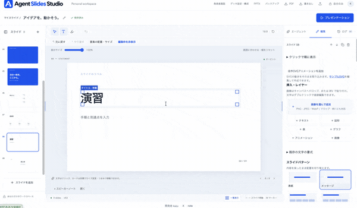
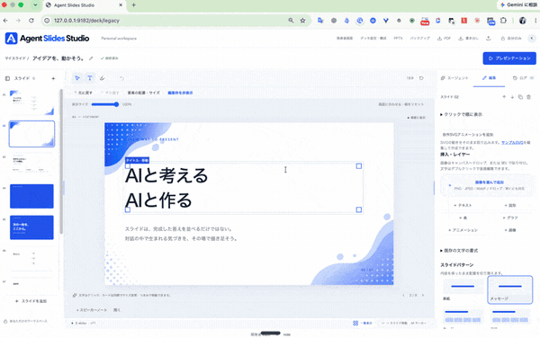

# Agent Slides Studio

ローカルで動く、AIエージェントを前提にしたスライド編集アプリです。
ブラウザで編集し、AIの変更案を見比べて採用し、変更理由と履歴を残せます。

**v0.9.0-beta.1 / macOS向け無料ベータ版。個人のローカル利用向けです。** 公開Webサービスとしての認証・複数ユーザー管理は備えていません。

モーションライブラリから動く装飾を追加し、スライド上で配置を調整できます。




## できること

- スライド一覧、10種類のレイアウト、直接テキスト編集と自動保存
- 画像のドロップ・貼付・切り抜き・差し替え
- テキスト・図形・表・グラフ・アニメーションの自由配置、複数選択、グループ移動、レイヤー
- Codexとの対話、変更範囲の固定、変更前後の比較、部分採用、生成停止
- 変更履歴（コメント任意）、Undo/Redo、ゴミ箱、画像・会話・履歴込みバックアップ
- 全体の配色・フォント変更、自分用テンプレート、提案書・活動報告・講義の構成セット
- プレゼン中の一時的なマーカー、ズーム、クリック表示、別ウィンドウの発表者画面
- PDFと編集可能なPPTXへの出力（動く装飾は静止画像）

### 編集画面の操作デモ



### 図形や背景を変更する


## はじめに

[5分で試すガイド](docs/GETTING_STARTED.md)と[練習用サンプル](public/samples/getting-started.json)を用意しています。

## 起動

Node.js **22.13以上**とnpmが必要です。macOSで動作確認しています。
Linux/Windows用のブラウザ検出にも対応していますが、実機検証は未実施です。

```sh
git clone https://github.com/kazu0914/agent-slides-studio.git
cd agent-slides-studio
npm ci
npm run build
npm start
```

ブラウザで <http://127.0.0.1:9182> を開きます。終了はターミナルでCtrl+C。
開発時は `npm run dev` でビルドと起動を続けて実行します。変更後は再ビルド・再起動してください。

### AIを使う場合

[Codex CLI](https://github.com/openai/codex)をインストールし、CLI側でログインしてください。
AIを使わずに手動で編集することもできます。画面に接続状態が表示され、インストールやログインの後は「再確認」で更新できます。無料・有料プラン名だけでは利用を拒否せず、認証状態と取得できる利用枠を確認します。

**この試用版のAIはWeb調査を行いません。** 参考資料の本文を貼り付けて編集を依頼してください。Codexの全機能を提供するものではありません。

本アプリはローカルの `codex app-server --stdio` を起動し、ログイン済みCodexを利用します。
CLIのバージョンによってモデルや利用可否が異なります。AI利用にはCodex側の認証・利用枠が必要です。
デッキの内容、指示、直近の会話はCodexへ送信されます。画像はローカル参照で、画像内容をモデルに送る実装ではありません。
Codexの認証ファイルをこのリポジトリへコピーしないでください。

### PDF・PPTXを使う場合

Google Chromeが見つかれば自動で使います。ない場合はPlaywrightのChromiumを用意してください。

```sh
npx playwright install chromium
```

画像・表・グラフは出力できますが、PowerPointへの完全な見た目・アニメーション互換は保証しません。
動画出力、クラウド共同編集は未対応です。

### PowerPointを取り込む

マイスライドの「PowerPointを取り込む」から `.pptx` を選択します（50MB・50枚まで）。新しいデッキとして保存し、元ファイルは変更しません。「編集」タブで文字はダブルクリック、画像・図形は選択してドラッグで編集できます。

文字、PNG/JPEG/WebP画像、基本図形、表の内容、スピーカーノートを取り込みます。16:9以外は比率を保ち中央に配置します。混在する文字書式、画像トリミング、表の書式は近似です。マスターの装飾、SmartArt、グラフ、動画、アニメーションは未対応で、検出した変換上の注意点を結果に表示します。完全なPowerPoint互換ではありません。ファイルはローカルで解析し、AIには送信しません。

## 設定とデータ

| 環境変数 | 用途 | 既定 |
| --- | --- | --- |
| `FRAME_PORT` | 待ち受けポート | `9182` |
| `FRAME_CODEX_BIN` | Codex CLIの実行ファイル | Macの同梱CLI、またはPATHのcodex |
| `FRAME_CHROME_BIN` | Chrome/Chromiumの実行ファイル | OS標準パス、またはPlaywright管理ブラウザ |

`.env.example` は説明用です。`.env`は自動で読み込まないため、シェルで環境変数を設定してください。
作業ディレクトリに `.local-data/` が作られ、SQLiteと画像が保存されます。
未保存の編集はブラウザのローカルストレージにも保持します。
引っ越しにはアプリの「バックアップ」と「履歴込みバックアップから復元」を使ってください。

サーバーは127.0.0.1のみにバインドしHost/Originを検査しますが、ユーザー認証はありません。
同じPCの別プロセスやユーザーはアクセスできます。ポートの外部公開・リバースプロキシ公開は想定していません。

## 背景画像

公開用背景5枚（ブルー・グリーン・オレンジ・サンシャイン・ピンクハート）を同梱しています。作者の個人用背景6枚は公開物に含めません。個人用背景を置いた環境では公開用5枚と併用できます。
追加方法は [背景フォルダーの説明](public/backgrounds/README.md) を参照してください。

## 開発と貢献

```sh
npm run typecheck
npm test
npm run build
npm run test:e2e
```

[CONTRIBUTING.md](CONTRIBUTING.md) に開発手順、[構成](docs/ARCHITECTURE.md)に設計、
[ROADMAP.md](ROADMAP.md)に実装範囲をまとめています。
不具合報告にはOS・Node/Codexのバージョン・再現手順を添えてください。
個人資料・会話・認証情報は添付しないでください。

検証した範囲と未検証の環境は [リリース確認記録](docs/RELEASE_CHECKS.md)、既知の依存関係の警告は [SECURITY.md](SECURITY.md) を参照してください。

## ライセンス

[MIT](LICENSE)。依存パッケージや第三者の素材については
[THIRD_PARTY_NOTICES.md](THIRD_PARTY_NOTICES.md)を参照してください。

### 編集の自動保存

文字は入力欄から離れて約1秒後、配置などの変更は操作を止めて約1秒後に自動保存されます。日本語変換中や文字入力にフォーカスしている間は保存を待ちます。変更理由の入力や保存ボタンの操作は不要です。変更履歴も自動で記録されます。保存に失敗した場合は画面に通知し、ブラウザ内の下書きを保持します。

### Claude Code・Codexに導入を依頼する

リポジトリにアクセスできるClaude CodeやCodexに、次のプロンプトを渡して導入を依頼できます。

```text
https://github.com/kazu0914/agent-slides-studio をこのPCに導入してください。
README.mdを読み、動作環境と必要な依存関係を確認してから、専用フォルダへcloneし、
インストール・ビルド・起動・ブラウザでの動作確認まで進めてください。
既存のアプリ、使用中のポート、保存データは変更しないでください。
Codex連携は利用可能なら設定し、ログインなど本人の操作が必要な手順は案内してください。
最後に起動URL、次回の起動方法、保存データの場所を教えてください。
```

初期対応はmacOS、Node.js 22.13以上です。
導入をClaude Codeに依頼しても、アプリ内のエージェント機能はCodex連携を使用します。
AIにURLを渡すだけで必ず完了するわけではなく、権限・依存関係・本人による認証が必要になる場合があります。

### 自作モーションを追加する

編集パネルの「自作SVGアニメーションを追加」から、100KB以下のSVGを読み込めます。
`public/samples/custom-motion.svg` を出発点に、SVGの `animate` / `animateTransform` で動きを作成してください。
SVGは画像として表示され、スクリプトの実行や外部ファイルの参照には対応しません。
位置・大きさ・回転・複製・削除は通常の要素と同様です。色・周期はSVG内で指定します。
自作SVGの再生はSVG自身が制御するため、アプリ共通の一時停止・速度設定の対象外です。
